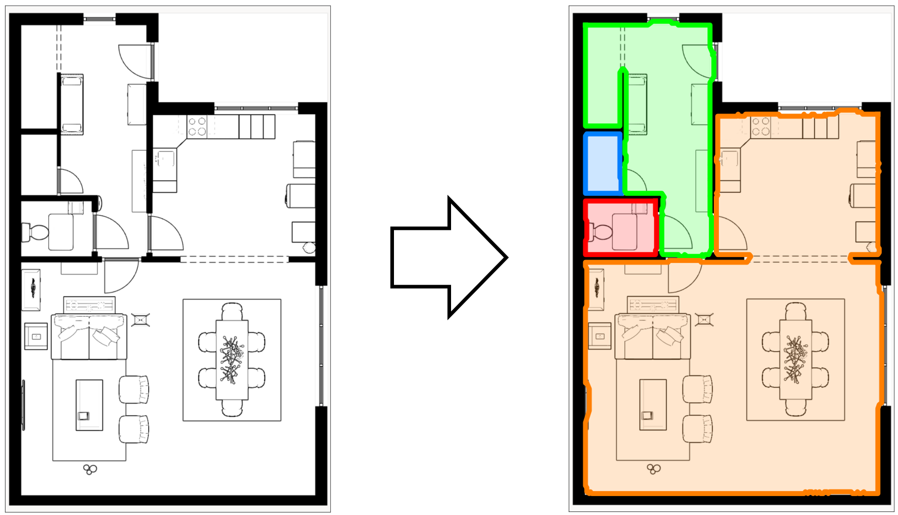
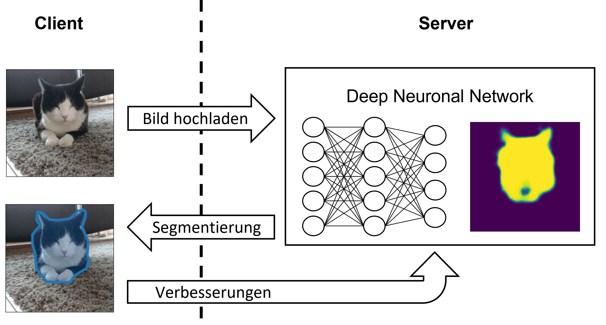
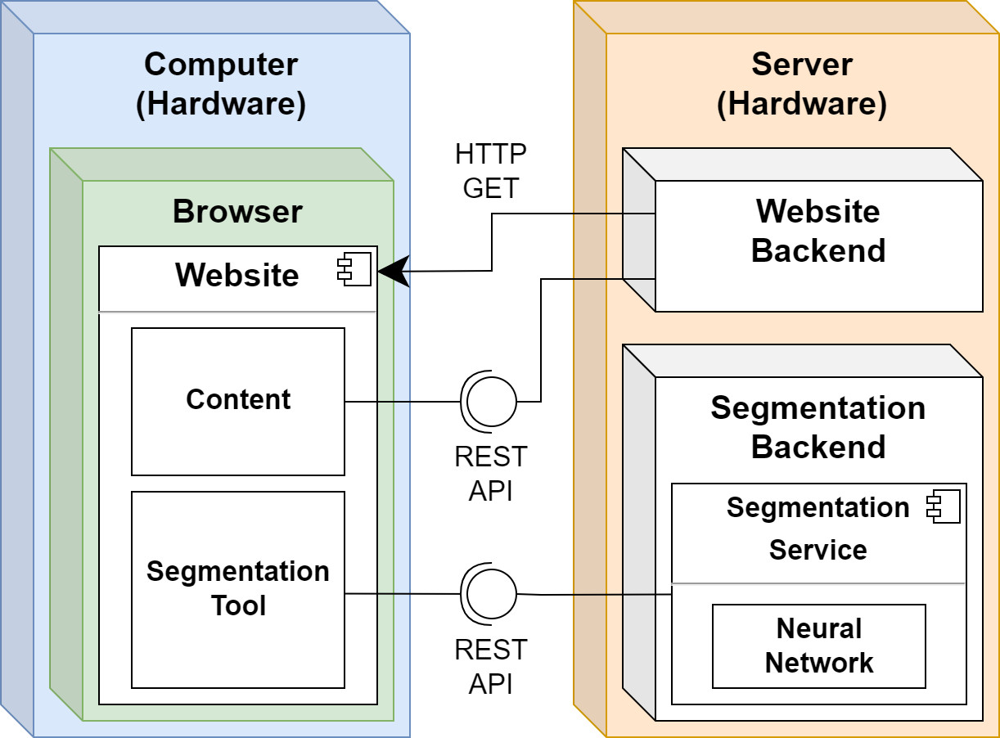

# Human-in-the-loop Image-Segmentation

## Installation
- Systemanforderungen
  - Python3
  - Node.js
- Projekt klonen
  - in './frontend/' über Konsole folgende Befehle ausführen:   
  npm install
  - in './backend/' über Konsole folgende Befehle ausführen:   
  python -m venv venv   
  venv\Scripts\activate.bat   
  pip install -r requirements.txt
 
 ## Ausführung
 - System starten (getestet auf Windows): 
    - in './' start.bat ausführen
 - Frontend und Backend separat starten (getestet auf Windwos):
    - für Server in './backend/' startServer.bat ausführen
    - für Frontend in './frontend/' start.bat ausführen
- über Kommandozeile:
  - für Server in './backend/' 'python REST_Server\main.py'
  - für Frontend in './frontend/' 'npm start'

## Einstellungen Backend 
Über Config-Dateien können diverse Speicherpfäde und andere Einstellungen definiert werden.
  - './backend/ImageSegmentation/config.json'
     - Pfad der Datenspeicherung
     - Pfad des Baseline-Neuronal-Network
     - Kategorien der Segmentationen
  - './backend/REST_Server/config.py'
    - Speicherpfad der Metadaten 

## Einstellungen Frontend
Bei der Einbindung der SegmentationTool-Komponente können diverse Einstellungen über Props definiert werden.
  - backendUrl: URL zum Server (nötig)
  - fallbackLabels: Falls das Backend nicht verfügbar ist werden auf diese zurückgegriffen (nötig)
  - downloadEnabled: Kann die Segmentation heruntergeladen werden (nötig)
  - callbackExport: Diesem Callback wird die Segmentation bei einem Export übergeben (optional)
  - imagePlaceholderUrl: Angabe eines optionalen Hintergrundbildes (optional) 

## Übersicht
### Problem
Die Image-Segmentation ist eines der Schlüsselprobleme auf dem Gebiet der Computer-Vision. Durch das Aufteilen eines Bildes in Segmente (Teilbereiche) kann der Weg zum vollständigen Verständnis des Bildinhalts geebnet werden. Die Bedeutung dieses Problems wird durch die Tatsache unterstrichen, dass eine wachsende Zahl von Anwendungen durch die Ableitung von Wissen aus Bildern lebt. Einige dieser Anwendungen umfassen autonome Fahrzeuge, Augmented Reality oder Gesichtserkennung. 
Heutzutage werden die besten Ergebnisse mit künstlichen neuronalen Netzwerken erreicht. Für das Trainieren dieser Netze werden jedoch grosse Datenmengen benötigt, welche in spezialisierten Nischenanwendungen meist nicht vorhanden sind.

  

### Konzept
Es wird der Human-in-the-loop Ansatz verfolgt, welcher die Verwendung von neuronalen Netzwerken mit einer manuellen Nachbearbeitung kombiniert. Dabei soll der Mensch die Segmentierung des neuronalen Netzwerks überprüfen und gegebenenfalls anpassen. Die überarbeitete Segmentierung wird in einem weiteren Schritt verwendet, um das neuronale Netzwerk zu verbessern. Somit lernt das System durch die Benutzung automatisch weiter und kann sich dynamisch der Anwendung anpassen.
Durch diesen Ansatz wird eine Effizienzsteigerung in Anwendungen ermöglicht, wo aufgrund der zu tiefen Qualität, eine reine AI-Lösung nicht in Frage kommt.

  

### Ergebnis
Das Resultat dieser Bachelorarbeit ist ein System zur AI-unterstützten Bildsegmentierung, welches sich leicht in eine bestehende Infrastruktur integrieren lässt. Dabei wurde der Anwendungsfall generalisiert, was beispielsweise eine Segmentierung von Katzenbildern oder Gebäudeplänen erlaubt.
Das System besteht aus einem Web-Frontend und einem Backend mit neuronalem Netzwerk. Im Frontend bearbeitet der Benutzer die KI-basierte Segmentierung. Das Backend kümmert sich um die Verwaltung und das Training des neuronalen Netzwerkes.

  

